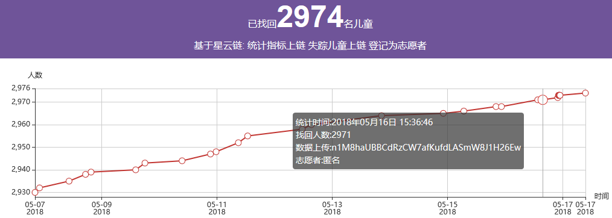
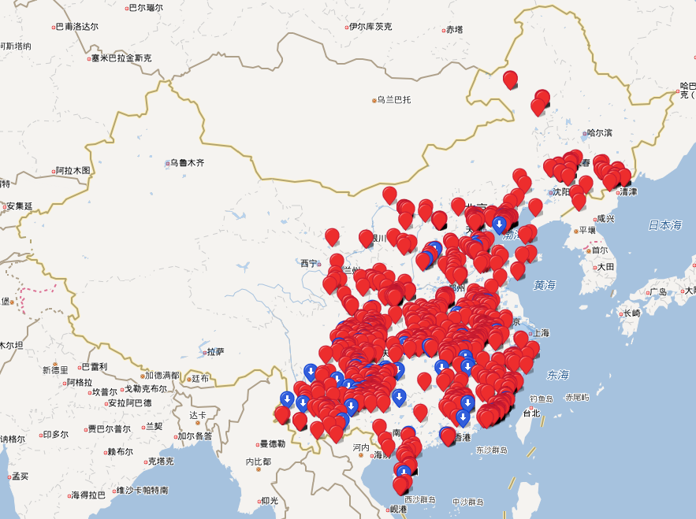

# 失踪儿童信息平台

失踪儿童信息平台主要的功能是将处于失踪状态的儿童的信息重点展示，希望能够有更多的人看到这些信息，多一个人关注这些失踪儿童的信息，那么就多了一丝找回来的希望。

## 平台建设规划
选定权威数据来源为公安部儿童失踪信息紧急发布平台，将失踪儿童的信息通过爬虫实时爬取的方式抽取、清理、转换后保存在本地的数据库。然后在本地
数据库的基础上，开发网站进行着重展示。调用微博api,根据失踪儿童信息状态的变化情况选择性的发布微博。另外，非常重要的一部分，失踪儿童数据上链，
选择星云链作为区块链技术的支撑。

网站：http://www.anman.org

新浪微博：https://weibo.com/u/3250808130

星云Dapp：http://www.anman.org/nebulas

## 平台建设现状

在数据采集、网站运行以及发微博，这些功能基本上实现了零维护全自动运行。

数据上链这部分还需要人工执行，接下来就将链上的这部分设想进行说明：

## 先回答为什么会选择星云链
* 数据存在本地数据库并不是一个长久的方案。目前失踪儿童平台这个项目是我自己在开发和维护，服务器资源是一方面，到今后如果这方面的软、硬件以及网络带宽等花销
太大，我承担不起了，那这个项目还能不能坚持下去呢，这使得我必须需要提前做好准备，一定要想办法让数据长期在线，就算我不在了，但这些失踪儿童的信息仍然在，仍然能够
被大家关注到。区块链，提供了去中心化的数据存证功能，我只需要花少量的矿工费，就能将数据永久的保存下来，并且任何人都可以自由的访问到。
* 在众多区块链项目，星云链是我认为最接地气的一个，星云（https://nebulas.io）项目作为新一代的区块链项目，我已经关注很长时间了，星云链将链上开发难度降到了最低，
开发者只需要会一些javascript的脚本就能做区块链的开发，正因为如此，我选择了星云链作为失踪儿童信息平台的区块链技术支撑。

## 智能合约地址

 1. https://github.com/luoam/anman_org_items
 2. https://github.com/luoam/anman_org_nebulas

## 合约2的功能

 ### 内置了一个set属性
 
 <pre>
 set: function (key, value) {
 }
 </pre>
 作用是让志愿者通过提交一个星云链的交易，将当前时刻找回的儿童的总数的统计指标写入到星云链。该条记录中记录了志愿者的钱包地址，我们认为
 这是志愿者队平台作出的一个贡献。
 
 统计的数据显示如下：
 
## 合约1的功能
 ### 志愿者登记
 
作为星云链上的公益平台，只有志愿者的参与，才能让平台更加良性的运作下去。
  因此，平台提供了这个志愿者身份认证的入口，凡是通过了志愿者认证的星云社区成员，将能享受到平台自带的一些特殊权利。
 
我们计划通过星云智能合约为每一个完成登记的志愿者办法链上唯一的证书。（ps：这个智能合约还待开发，有兴趣的小伙伴们可以尝试开发。）
 
 ### 向星云链写入失踪儿童的信息
 目前在失踪儿童信息平台的后端有一套爬虫程序实时从公安部儿童失踪信息紧急发布平台同步数据到本地数据库，但是没有实现自动上链，失踪儿童信息上链这个功能
 ，我们不打算实现自动化，而是将这个操作开放给志愿者，凡是登记过的志愿者，都可以使用平台提供的上链页面完成本地数据库向星云链写数据。同样的，由志愿者
 写入的数据都标记了志愿者的钱包地址，并且永久存在，将来我们通过统计这些记录来评价志愿者向平台作出的贡献值。
 
 ### 批量写入已找回儿童的信息 
 这部分是属于历史信息，在平台不进行展示，但是这些数据应该具有一些分析的价值。这部分价值还需要社会科学家们去发掘。我之前根据每个失踪儿童的位置信息制作过一个
 全国失踪儿童分布地图：http://www.anman.org/index/map
 通过图形化的展示，我们非常直观的可以看到部分地区儿童失踪的案件频繁发生，而有些地区鲜有儿童失踪，这背后还隐含着什么背景原因呢，这些可以有人去分析和研究，最终呢，
 希望这样的努力能够让儿童失踪的案件更少的发生。
 
 
 ### 从链上取得失踪儿童的信息
 从链上取失踪儿童的信息，这个是开放的，任何星云的社区成员，都可以自由的从链上取得失踪儿童的信息。可以将取得的数据做成网页，也可以在app中进行调用，根据自己的方式来做这件
 公益事业。
 
 ### 从链上取得已经找回的儿童信息
 这个操作只有登记的志愿者才可以进行，这也本项目设计思路中，面向认证志愿者开放的功能。
 
 
 
## 项目运作：
目前该项目一些复杂机械新的操作都由后台程序自动完成。

目前安满作为本项目唯一注册的志愿者，复杂完成数据上链的工作。同时也负责项目代码的更新。

初次登记为志愿者需要支付10NAS

在使用信息上链工具，每成功上链一条记录，奖励0.01NAS

在每年第四个季度完成上一时间段的奖励发放，在合约（该合约还需要开发）中记录上次计算过的itemid，下次申请是从该itemid开始计算总奖励。

如果奖励的总NAS数超过了注册收集的总NAS数，则超过的部分暂停奖励，记在合约里，在有NAS支持后继续发放。

希望通过这样的方式能够鼓励大家与我一起在星云链上完成这项公益事业。
#### 失踪儿童信息平台对以上内容享有最终解释权