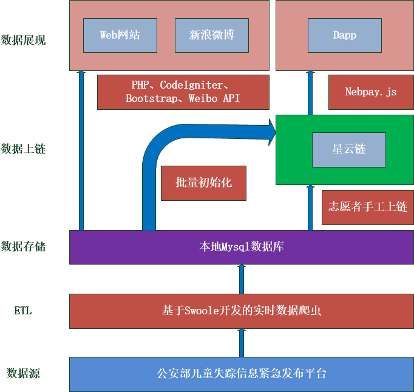

#失踪儿童信息平台

失踪儿童信息平台主要的功能是将处于失踪状态的儿童的信息重点展示，希望能够有更多的人看到这些信息，多一个人关注这些失踪儿童的信息，那么就多了一丝找回来的希望。

#平台建设规划
选定权威数据来源为公安部儿童失踪信息紧急发布平台，将失踪儿童的信息通过爬虫实时爬取的方式抽取、清理、转换后保存在本地的数据库。然后在本地
数据库的基础上，开发网站进行着重展示。调用微博api,根据失踪儿童信息状态的变化情况选择性的发布微博。另外，非常重要的一部分，失踪儿童数据上链，
选择星云链作为区块链技术的支撑。

网站：http://www.anman.org

新浪微博：https://weibo.com/u/3250808130

星云Dapp：http://www.anman.org/nebulas

# 平台建设现状

在数据采集、网站运行以及发微博，这些功能基本上实现了零维护全自动运行。

数据上链这部分还需要人工执行，接下来就将链上的这部分设想进行说明：

## 智能合约地址

https://github.com/luoam/anman_org_items

##合约的功能

 1. 
 
## 规则：

初次登记为志愿者需要支付10NAS

在使用信息上链工具，每成功上链一条记录，奖励0.01NAS

定期（时间待定）可以发放奖励，在合约中记录上次计算过的itemid，下次申请是从该itemid开始计算总奖励